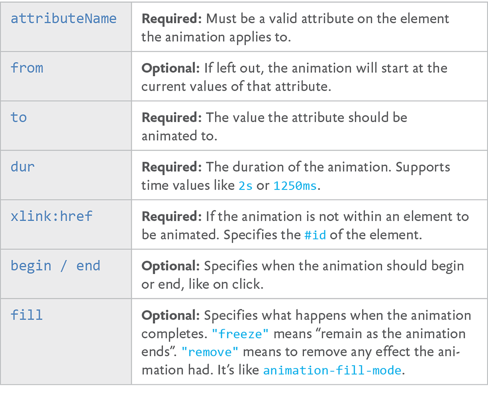
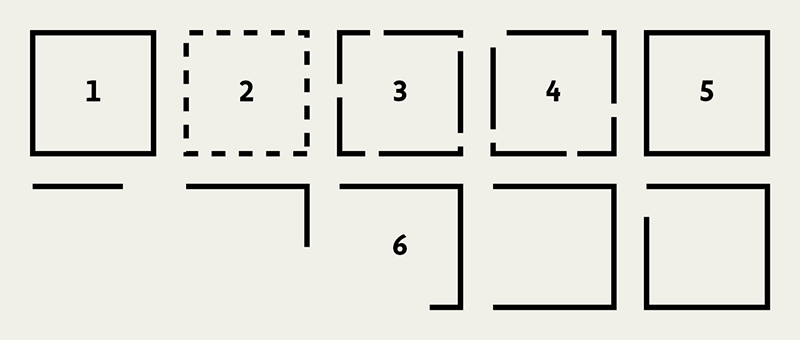

THERE ARE THREE distinctly different ways to animate SVG: with CSS, with SMIL, and with JavaScript. All of them are compelling and appropriate in different situations. SVG can accommodate anything from minor little UI-embellishing animations to full-on immersive, interactive, animated worlds.

## ANIMATING SVG WITH CSS

Readers who have made it this far, I reckon, are well acquainted with CSS and find transitions and `@keyframe` animations fairly straightforward and comfortable.

Lucky for you, the same CSS techniques you use for animating and transitioning HTML elements also work on inline SVG elements.

Let me give you an example. Say we’ve designed a display ad in SVG (FIG 7.1). We want to slowly animate a series of clouds horizontally across the ad to add a little visual interest. To do this, we’ll duplicate some clouds we already have in our original artwork (FIG 7.2).

```
<svg>
  <g class="clouds">
    <path d=" ... " />
    <path d=" ... " />
    <path d=" ... " />
    <path d=" ... " />
  </g>
</svg>
```

")

The idea is that we can animate the whole row of clouds so that the duplicates are in the exact same position as the originals, but then instantly jump back to their initial position. That way, the clouds can infinitely animate.

```
.clouds {
  animation: move-clouds 15s linear infinite;
}
@keyframes move-clouds {
  to {
    transform: translateX(-50%);
  }
}
```

That’s all there is to it! I’ve put up a demo on CodePen ([http://bkaprt.com/psvg/07-01/](http://bkaprt.com/psvg/07-01/)).

So under what circumstances would you choose CSS to animate SVG?

1. You’re doing most of your design work in CSS and want to keep it there. You like the syntax of CSS.
2. You’re using inline SVG so you can keep the CSS together with your site’s main stylesheets.
3. The animation is fairly simple and CSS is able to animate the things you need to animate (like positions, fills, strokes).
4. You’re hoping to exploit the performance and browser optimizations of CSS animations.
5. You want to put a block of `style` inside the SVG, hoping it works in SVG as `img` or `background-image`. Mileage may vary. It works today in Chrome, but not in Firefox. SMIL animation works in both—that’s coming up next ([http://bkaprt.com/psvg/07-02/](http://bkaprt.com/psvg/07-02/))!

Why might you *avoid* CSS animations on SVG?

1. CSS can’t animate everything you might want to animate, like the position of an individual point. CSS can animate properties but not attributes. (Presentational attributes are properties.)
2. Your animation is fairly complex, and you need better tools than `@keyframes` or transitions. For instance, you might want to start one part of an animation when another ends, without having to match up timing manually.
3. You’re experiencing buggy or broken behavior. Needless to say, there is quite a bit of this. Internet Explorer doesn’t support CSS animations on SVG elements at all. Firefox doesn’t support percentage-based `transform-origin`, which is sometimes vital to an animation. It’s…a complicated love story ([http://bkaprt.com/psvg/07-03/](http://bkaprt.com/psvg/07-03/)).

## ANIMATING SVG WITH SMIL

SVG actually has its own syntax for animation built right into it. It’s a part of SMIL (pronounced “smile”), which stands for *Synchronized Multimedia* *Integration Language* ([http://bkaprt.com/psvg/07-04/](http://bkaprt.com/psvg/07-04/)). The `animate` tag is our primary weapon here. While it can get complicated, the syntax is pretty straightforward and declarative:

```
<circle r="30" cx="50" cy="50" fill="orange">

  <animate 
     attributeName="cx"
     from="50"
     to="450" 
     dur="1s"
     begin="click"
     fill="freeze" />
</circle>
```

In this example, an orange circle moves to the right by `400` when it’s clicked, and then stays there.

FIG 7.3 shows the basic attributes of `animate` ([http://bkaprt.com/psvg/07-05/)](http://bkaprt.com/psvg/07-05/).



Using just these attributes, we can build the sort of animation that is outside the realm of possibility in CSS: shape-shifting. Imagine a form that slowly changes its shape over time:

We see color-changing and position-changing effects in animations on the web regularly, but shape-shifting is more unusual. Its relative scarcity stems from the fact that CSS just doesn’t offer access to this visual attribute. But SMIL can do it!

Shapes are drawn from data in attributes on the shape elements themselves, for instance the `d` in `path d=""`. In the star-to-check-mark example, the shape element is a `polygon` and the attribute is `points`, as in `polygon points="".` So to animate the the shape, we animate the `points` attribute.

```
<polygon points=" ... shape 1 points ... ">
  <animate 
    id="animate-to-check"
    attributeName="points" 
    dur="500ms" 
    to=" ... shape 2 points ... " />
</polygon>
```


We can trigger that animation with SMIL events, like we did in the orange circle example, but we can also trigger animations like this with JavaScript.

```
var ani = document.getElementById("animation-to-check");
ani.beginElement();
```

Why use SMIL at all? Here are the main reasons why you might reach for it:

* You can use it to animate things that CSS can’t, like the shape of elements or the movement of elements along a path.
* You’re working in the SVG directly and you like working there. Or you like the declarative syntax in general.
* The animation may work even when using SVG as `img` or `background-image`, where CSS or JavaScript will not.
* You want interactive features (hovers, clicks, etc.) without using JavaScript.
* You need timings that depend on other timings—*Start this animation when this other one ends**, plus a second*—without having to keep everything in sync manually.

Are there reasons not to use SMIL? Sure:

* Blink has deprecated SMIL ([http://bkaprt.com/psvg/07-06/](http://bkaprt.com/psvg/07-06/)), which means that, at some point, SMIL animations will likely stop working in Chrome and Opera. Microsoft browsers have never supported, and likely will never support, SMIL—and that’s a big strike against it ([http://bkaprt.com/psvg/07-07/](http://bkaprt.com/psvg/07-07/)).
* It’s very repetitive. A single `animate` can only animate one element. Even if you want a second element to do the exact same animation, you’ll need to duplicate it. GZIP is good at compressing repetitive code, so this poses no serious file-size concerns—but still, awkward.


Some great articles by Sarah Drasner can help us out here. In “Weighing SVG Animation Techniques (with Benchmarks)”, she gathers some standard measures for comparing the performance of a number of SVG animation techniques ([http://bkaprt.com/psvg/07-08/](http://bkaprt.com/psvg/07-08/)). The story still isn’t perfectly clear—CSS and SMIL tend to perform the best generally, but you need to take care to ensure that you’re getting hardware acceleration. Plus, there is evidence that JavaScript animation can outperform them all in some cases ([http://bkaprt.com/psvg/07-09/](http://bkaprt.com/psvg/07-09/)). Sarah also wrote a guide detailing alternatives to SMIL features ([http://bkaprt.com/psvg/07-10/](http://bkaprt.com/psvg/07-10/)).

### Embedded animations

When you use SMIL, the animation code is embedded into the SVG syntax itself. The same is true if you use CSS to animate the SVG and put that CSS in a `style` block within the SVG code. When this is the case, depending on the browser, that animation might work even if you use the SVG as an `img` or `background-image`.

```

```

People often reach for GIFs when they need to show animation in an `img`, but GIFs can have large file sizes and (therefore) create a serious performance burden. Animation embedded into SVG and used in an `img` is an attractive alternative, but unfortunately it’s not supported nearly as widely as GIF’s (for example, it doesn’t work in Firefox).

This is not a comprehensive look at SMIL. There are many more attributes you can apply if you want to do more specific things. For instance, you can run an animation multiple times (e.g., `repeatCount="3"`), animate the numbers in specific blocks (e.g., `by="10"`), or control whether or not the animation is allowed to restart and when (e.g., `restart="whenNotActive"`).

There are even other animation elements, like 
`animateTransform`, that allow you to animate the `transform` attribute on SVG elements. You can’t do that with `animate` alone ([http://bkaprt.com/psvg/07-11/](http://bkaprt.com/psvg/07-11/))—for instance, this doesn’t work:

```
<animate
  attributeName="transform"
  from="rotate(0 60 70)"
  to="rotate(360 60 70)"
  dur="10s" />
```

Instead, you need to do this:

```
<animateTransform
  attributeName="transform"
  type="rotate"
  from="0 60 70"
  to="360 60 70"
  dur="10s" />
```

Another SMIL element opens up an interesting animation possibility: animating an element along a `path`. Imagine a little paper airplane floating across the screen, or a ball rolling down a hill. `animateMotion` is our friend here. It can animate any other SVG element along a `path` (but only a `path`; other basic shapes don’t work). Here’s a very simple example of animating an element in a circle ([http://bkaprt.com/psvg/07-12/](http://bkaprt.com/psvg/07-12/)):

```
<svg viewBox="0,0 10,10" width="200px" height="200px">

  <path 
    id="theMotionPath"
    fill="none"
    stroke="lightgrey"
    stroke-width="0.25"
    d="
      M 5 5
      m -4, 0
      a 4,4 0 1,0  8,0
      a 4,4 0 1,0 -8,0
      "
  />

  <circle r="1" fill="red">
    <animateMotion dur="5s" repeatCount="indefinite">
       <mpath xlink:href="#theMotionPath" />
    </animateMotion>
  </circle>

</svg>
```

That may not look tremendously simple at first blush, but remember that you probably won’t be crafting that `path` by hand; you’ll just be referencing it by ID.

This has long been nearly impossible in CSS. The most you could do was animate position values or get very tricky with `transform`s (see Lea Verou’s post on this topic, for example \[[http://bkaprt.com/psvg/07-13/](http://bkaprt.com/psvg/07-13/)\]). But new CSS properties can help: `motion-path: path()` and `motion-offset`. Blink already supports motion paths ([http://bkaprt.com/psvg/07-14/](http://bkaprt.com/psvg/07-14/)), perhaps motivated by the SMIL deprecation. You can take the `path` data and use it directly, which makes moving a SMIL `path` animation to CSS quite easy! Here’s how:

```
.move-me {
  motion-offset: 0
  motion-path: path("M 5 5 m -4, 0 a 4,4 0 1,0 8,  0 a 4,4 0 1,0 -8,0");
}
.move-me:hover {
  motion-offset: 100%;
}
```

For a more comprehensive look at SMIL animations, check out Sara Soueidan’s “Guide to SVG Animations” and the spec ([http://bkaprt.com/psvg/07-15/](http://bkaprt.com/psvg/07-15/), [http://bkaprt.com/psvg/07-16/](http://bkaprt.com/psvg/07-16/)).

## ANIMATING PATHS

There’s a little trick we can do with the stroke on SVG shapes: we can make it look as if the shape is drawing itself. It’s clever as heck. A blog post by Jake Archibald first made me aware of the trick ([http://bkaprt.com/psvg/07-17/](http://bkaprt.com/psvg/07-17/)).

Here’s how it works (FIG 7.5, [http://bkaprt.com/psvg/07-18/](http://bkaprt.com/psvg/07-18/)):

1. Imagine you make an SVG shape with a stroke. You set strokes with attributes like these: `stroke="black"` and `stroke-width``="2"`.
2. Strokes can be dashed, with an attribute like this: `stroke-dasharray="5, 5"`, meaning “a dash five long followed by a space five long.”
3. The dashes can be longer, as in `stroke-dasharray="30``, 5"`. In fact, they can be any length.
4. You can also offset the stroke, which moves the starting position of those dashes, with an attribute like this: `stroke-dashoffset="30"`.
5. Imagine a dash so long that it covers the entire shape, and a space after it that is equally long. You could offset the stroke so that it looks like it’s entirely covering the shape, or offset it so that it looks like there is no stroke at all.
6. Now imagine an animation that animates from fully offset back to `0`. The shape will “draw itself.”



You can do all that in CSS, but with a dash of JavaScript, it becomes a little more foolproof. `path` elements have a property you can access via JavaScript that tells you exactly how long the element is:

```
var path = document.querySelector(".path");
var length = path.getTotalLength();
```

The resulting `length` number is exactly what the dash length and stroke offset need to be to do this trick.

## ANIMATING SVG WITH JAVASCRIPT

JavaScript can animate SVG because JavaScript is all-powerful. In other words, JavaScript can manipulate things in the DOM. For instance, you can select an element with JavaScript and change the class name on it. JavaScript 101. A class name is just an attribute on an element. A circle’s `cx` is just an attribute on an element, too. It controls the position of the center of the circle on the x-axis. JavaScript can change that.

JavaScript also has the ability to run a loop. Let’s say we increased the `cx` attribute by `10` every 10 milliseconds:

```
var circle = document.getElementById("orange-circle"), positionX = 0;
var interval = setInterval(function() {

  positionX += 10;

  if (positionX > 500) {
    positionX = 0;
  }

  circle.setAttribute("cx", positionX);

}, 20);
```

That’s animation ([http://bkaprt.com/psvg/07-19/](http://bkaprt.com/psvg/07-19/))! That orange circle will animate from left to right over and over and over again.

It’s not particularly efficient, though. For starters, `setInterval` isn’t ideal for animations because the browser can’t really optimize it. It can’t, for example, stop the animation when it’s not visible, or make it as smooth as possible.

The best approach to animation looping in JavaScript is `requestAnimationFrame` ([http://bkaprt.com/psvg/07-20/](http://bkaprt.com/psvg/07-20/)). At its most basic:

```
function doAnimation() {
  // Do animation things
  requestAnimationFrame(doAnimation);
}
requestAnimationFrame(doAnimation);
```

That loop will run as close to 60 *frames per* *second* (FPS) as it can. The idea is that 60 FPS is what is required to make an animation appear very smooth to our eyes. That’s great; it just means that that loop runs very fast, and that it’s up to you to figure out the timing and duration.

There’s an even better way to proceed here: use a JavaScript library built for animation. I wanted to cover the attribute-altering and looping concepts first, because that’s what any library is actually doing under the hood. But these concepts offer us ways to declare animations that are easier to write and read, give us powerful options, and do the hard work behind the scenes for us.

Before we look at some examples, let’s consider why we would want to use JavaScript to animate SVG:

* You’re already working primarily in JavaScript and like to keep your work there. Or you just like the syntax of JavaScript.
* You’re working with a data source in JavaScript.
* You need JavaScript to do math, loops, logic, or other programmery things.
* You need JavaScript to normalize some cross-browser bugs for you, like the known bugs with CSS `transform`s on SVG ([http://bkaprt.com/psvg/07-21/](http://bkaprt.com/psvg/07-21/)).

And why would you avoid JavaScript here?

* Libraries add additional, significant weight to the page.
* JavaScript only works when it is available in the browser and loads properly.
* It only works on inline SVG or in contexts where external references are allowed, like `object` and `iframe`.

### Snap.svg

Snap.svg is heralded as the “jQuery of SVG” ([http://bkaprt.com/psvg/07-21/](http://bkaprt.com/psvg/07-21/)). It can be used to create and manipulate SVG, as well as animate it. To use it, you’ll need to add the script to your page before you write any Snap.svg-specific JavaScript.

<script src="snap.svg.js"></script>

It has no other dependencies, so after you add it, you’re ready to use it ([http://bkaprt.com/psvg/07-22/](http://bkaprt.com/psvg/07-22/)).

```
<script>
  // create a new <svg> on the page
  // or use Snap("#existing-svg")
  var s = Snap(800, 600);
  // Draw a <circle>
  // Those attributes are cx, cy, and r
  var bigCircle = s.circle(150, 150, 100);
  // Manipulate the fill attribute to be "green"
  bigCircle.attr({
    fill: "green"
  });
  // Animate the radius and fill over one second
  bigCircle.animate({
    r: 50,
    fill: "lightgreen"
  }, 1000);
</script>
```

And that’s only a drop in the bucket of Snap.svg’s capabilities. Just as jQuery can help with anything DOM-related, like cloning elements, manipulating attributes, or attaching event handlers, so, too, can Snap.svg. Except that Snap.svg will do everything correctly in SVG, while jQuery may not. For instance, you’d think you could use jQuery’s `.addClass()` method on an SVG element. Unfortunately, that will fail—the workaround is `.attr("class``", "foo")`—but Snap.svg’s identical `.addClass()` *will* work.

Read the Snap.svg documentation for a full look at what it can do; also, check out Pens tagged “snapsvg” on CodePen for a bunch of examples ([http://bkaprt.com/psvg/07-23/](http://bkaprt.com/psvg/07-23/), [http://bkaprt.com/psvg/07-24/](http://bkaprt.com/psvg/07-24/)).

### Greensock

Greensock is a robust and performant library focused on animation ([greensock.com](https://greensock.com/)). It wasn’t developed specifically for SVG, but it works great with it. Google even recommends Greensock to those looking for a dedicated animation library ([http://bkaprt.com/psvg/07-25/](http://bkaprt.com/psvg/07-25/)).

Say you have existing SVG like this:

```
<svg width="260" height="200" viewBox="0 0 260 200">
  <rect id="rect" x="20" y="60" width="220"   height="80" fill="#91e600" />
</svg>
```

Let’s target that `rect`, turn it in a circle, and halve the size of it over five seconds:

```
TweenMax.to("#rect", 5, {
  rotation: 360, 
  transformOrigin: "50% 50%",
  scale: 0.5
});
```

This is a particularly pertinent example, because if you try to do this exact same animation in CSS, you’ll run into a lot of trouble. Here’s why:

* IE and Opera won’t do CSS transforms on SVG elements at all, let alone animate them.
* Firefox won’t honor the percentage-based `transformOrigin` we’ve set there (nor will it do keywords).
* Safari will break the animation if the page is zoomed in either direction, not scaling the elements in sync with each other.

Greensock, beyond providing a nice API for animations as well as executing them smoothly, normalizes all of these bugs across browsers so the animation will work as expected. Pretty nice!

Using a JavaScript library for animation doesn’t mean you’re neglecting performance. In fact, the opposite may be true. In some cases, JavaScript will yield better performance. In a video, Greensock’s Jack Doyle tests pure CSS against Greensock in some fairly intense animations, confirming that performance is a tricky thing; lots of factors ultimately affect the viewing and interacting experience ([http://bkaprt.com/psvg/07-26/](http://bkaprt.com/psvg/07-26/)). Things like memory usage, painting area, and time, as well as the the effect on the frames per second a page can display, all impact performance.

Greensock’s own CodePen account has loads of examples and demos on how to use it ([http://bkaprt.com/psvg/07-27/](http://bkaprt.com/psvg/07-27/)).

## REFLECTING ON ANIMATION

Congratulations—you’ve just made it through a whole lot of SVG animation information. There is much to love about animating SVG:

* You can easily jump into it using what you already know about animating in CSS.
* You can control and animate more design features (like strokes) than you can with HTML elements.
* You can really get serious about SVG animation, creating whole experiences, interactive spaces, and complex timelines.
* Lastly, you can port that knowledge back to animating HTML when needed.

The fact that SVG goes so well with HTML, CSS, and 
JavaScript is a good reason for SVG to be in every front-end developer’s toolbox. And SVG has design features that we haven’t even touched on yet that cross the boundaries between these languages. Let’s dig into some of those features next.
