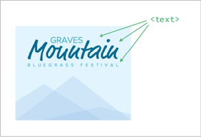

WE’VE TALKED ABOUT HOW browser support for SVG is pretty good, but not ubiquitous. IE 8 and Android 2.3 don’t support it at all, and I’d say those are pretty reasonable browser-support targets for a lot of websites. Does that mean we give up on using SVG for sites that need to accommodate them? Absolutely not. We don’t need to punish newer browsers for older browsers’ lack of support, just as we don’t need to punish older browsers with broken design and functionality.

The fallback approach that will work for you depends on how you are using SVG. But first things first.

## DO YOU NEED A FALLBACK AT ALL?

Sometimes the way we use images is purely complementary. The website will function just fine without them. For instance, imagine our SVG icon system, and a shopping cart icon next to the phrase “View Cart” in a button. Without that icon, it’s still a button that says “View Cart.” Not as fancy, but perfectly functional. In this case, we could feasibly skip worrying about a fallback at all.

SVG used in CSS as a background image also commonly falls into this category. Although we will cover a fallback technique for that, images applied in CSS are generally decorative. Making sure that the content on top of the background is still usable may be the only fallback you need.


## FALLBACK FOR SVG-AS-img

The simplest approach here is to use SVG as you normally would:

```

```

Then replace that `src` with something that will be supported, like dog.png. That’s exactly what the SVGeezy script by Ben Howdle does ([http://bkaprt.com/psvg/09-01/](http://bkaprt.com/psvg/09-01/)). If the script determines that a browser doesn’t support SVG in this way, it will replace the `src`, and end up looking like this in the DOM:

```
  
  <!-- 
     this will be turned into this
         
      if the browser doesn’t support SVG this way -->
  <script src="/js/libs/svgeezy.js"></script>
  <script>
    svgeezy.init(false, "png");
  </script>
</body>
```

The file type is configurable, but it’s on you to ensure that the fallback image is located in the same location as the SVG.

This works, but it comes at a cost beyond just loading additional JavaScript. Non-supporting browsers will actually download both versions of the image before ultimately using the fallback. That means we’ve already betrayed our ideal of not punishing older browsers.

We can beat this double-download problem, and we’ll get to that in a moment. But first, we can learn something else very useful. SVGeezy tests for SVG-as-`img` support with this function:

```
supportsSvg: function() {
  return document.implementation.hasFeature("http://www.w3.org/TR/SVG11/feature#Image", "1.1");
}
```

Um, `document.implementation.hasFeature`? What is this wizardry? Is there some native JavaScript API for testing feature support? For that sort of thing, we normally turn to Modernizr, a library built from an amalgam of clever tests developers have concocted to coerce browsers into telling us whether they support a certain feature or not ([http://modernizr.com](http://modernizr.com)).

Turns out this unusual `hasFeature` thing is no dream come true. It’s actually quite old and largely deprecated, but it’s still interesting. `document.implementation.hasFeature` returns true for everything, except when you use it exactly as shown above, in which case it returns true or false perfectly in all known browsers based on whether that browser supports SVG-as-`img` or not. So in case you need this information, now you know that it’s quite easy to get.

And why might you need to know if a browser supports SVG-as-`img` in JavaScript? Perhaps you’ll use that information to decide if you’re going to load additional scripts to help with a fallback. Or you’ll use it as part of a test to make a general determination about what kind of experience your site is going to deliver to that browser, a technique now known as *mustard-cutting* ([http://bkaprt.com/psvg/09-02/](http://bkaprt.com/psvg/09-02/)).

You could easily build your own SVG-as-`img` fallback system:

```
// do the test
if (!document.implementation.hasFeature("http://www.w3.org/TR/SVG11/feature#Image", "1.1")) {
  // if the browser doesn’t support SVG-as-
  // find all images
  var images = document.getElementsByTagName("img"),   i, src, newsrc;
  // loop through them
  for (i = 0; i < images.length; i++) {
    src = images[i].src;
    ext = src.split(".").pop();
    // if the image is .svg (note this doesn’t     account for ?query strings
    if (ext === "svg") {
      // replace that with .png
      newsrc = src.replace(".svg", ".png");
  images[i].setAttribute("src", newsrc);
    }
  }
}
```

These techniques also require a little more elbow grease: you have to create the fallback images yourself and place them alongside their `.svg` comrades. So when the `src` is replaced, the `.png` version is there to pop into position. Wouldn’t it be nice if that were automated?

That’s what SVGMagic helps you do ([http://bkaprt.com/psvg/09-03/](http://bkaprt.com/psvg/09-03/)). Simply use SVG-as-`img` like you normally would. Then load and initialize the plugin. If it decides the browser needs fallback PNGs, it will automatically create them for you. It does so by making a network request to SVGMagic’s servers, which return the new images. Be forewarned, though, that that’s a dependency over which you have no control.

We still haven’t found a way around the double-download issue, so let’s do that next.

One way of circumventing it is to use the `picture` element. The `picture` element is often thought of as a solution for responsive images (serving differently *sized* images as needed), but it can also serve different image *types* depending on support.

Here’s how that works in HTML:

```
<picture>
  <source type="image/svg+xml" srcset="graph.svg">
  
</picture>
```

If the browser supports SVG this way, `source` will be used; otherwise, the fallback PNG in the `img` tag will be served, without the double-download. It’s pretty great to have a fallback solution like this right in HTML. The rub is that the browser *also* needs to support `picture`, which is so new that any browser that supports it also supports SVG.

That doesn’t eliminate this solution from the running, though, thanks to Picturefill, a script that makes `picture` work in any browser ([http://bkaprt.com/psvg/09-04/](http://bkaprt.com/psvg/09-04/)). This sort of script is called a *polyfill*, by the way. When you load up Picturefill, the `picture` syntax will work great, delivering SVG to supporting browsers and the fallback otherwise.

As a nice side bonus, you can use the `picture` syntax to deliver differently-sized fallback images, if necessary. For instance, you might want to serve a PNG that is 800 pixels wide for a desktop IE 8, but that would be a waste of bandwidth for a non-Retina iPhone, so you’d like to serve a 320-pixel version there. That’s all possible with `picture`.

There is a catch though, beyond loading the 7 KB script. The reason double-downloads happen in the first place is because of that `img src` in the HTML. Browsers do what is called *prefetching*—they zoom through a page looking for resources they can start downloading right away. Prefetching is a good thing, because it helps make the web fast. But we have no control over it. In the `picture` syntax we looked at, notice this part: `img src="graph.png"`. Prefetching will catch that and download graph.png, whether it ends up being used or not.

In a browser that natively supports `picture`, the prefetcher will be smart enough not to do that. But we can’t count on that (hence the polyfill). To solve this, we can just skip the `src` and make the markup more like this:

```
<picture>
  <source srcset="graph.svg" type="image/svg+xml">
  
</picture>
```

Solved! Even though, as I write this, that’s technically invalid code, it works with Picturefill and in browsers that already support `picture`. So you could even safely pull out Picturefill one day and not worry about breaking anything. I wouldn’t be terribly surprised if this eventually becomes valid markup, since it’s so useful.

## FALLBACK FOR SVG AS background-image

This method is pretty great, because it relies on some simple sleight of hand right in the CSS, rather than on some other technology or much additional code.

```
.my-element {
  background-image: url(fallback.png);
  background-image: 
    linear-gradient(transparent, transparent),
    url(image.svg);
}
```

It does the trick because of some serendipitous overlap in features that browsers support. Two forces are at work here: multiple backgrounds and “old” syntax gradients. A browser that supports both of these things also necessarily supports SVG as `background-image`. Thus, the SVG background image we supplied here will be shown (the gradient is completely transparent and will have no effect). If either of those things fails, the whole declaration fails, and the fallback `background-image` declaration takes effect.

Because this is so straightforward, it’s kind of tempting to exploit it for images used in HTML as well. After all, it would be pretty easy to just use a `div` with a background instead of an image. The danger here is that background images aren’t content. If the content here were ever syndicated through email or RSS, you’d lose the background images entirely. Not to mention that that usage is semantically incorrect, and you’d have to take extra steps to ensure accessibility. There is no `alt` text for background images.

Another possibility here would be to run the JavaScript test for SVG-as-`img` (the support is identical for background images), add a class to to the `html` element (something like 
`<html class="no-svg">`) and then:

```
.my-element {
  background-image: url(image.svg);
}
html.no-svg .my-element {
  background-image: url(fallback.png);
}
```

This works, but since it requires JavaScript, I prefer the multiple-backgrounds trick.

## FALLBACK FOR INLINE SVG

Building a fallback for inline SVG is a little trickier than the other two, but certainly doable. Let’s break it into two categories.

Do you want to start with SVG and gracefully degrade?

This method is forward-thinking in the sense that down the road, you can decide to pull out the fallback if you think browser support is good enough.

Here’s a possible approach, one I quite like:

1. Use inline SVG normally:
    ```
    <svg class="icon icon-cart" xmlns="http://www.w3.org/2000/svg">
      <use xlink:href="#icon-cart"></use>
    </svg>
    ```
    
2. Make an inline SVG test in JavaScript:
    ```
    var supportsSvg = function() {
      var div = document.createElement("div");
      div.innerHTML = "<svg/>";
      return (div.firstChild && div.firstChild.namespaceURI) == "http://www.w3.org/2000/svg";
    };
    ```
    
3. If the browser doesn’t support inline SVG, add a class name to the `html` element:
    ```
    if (supportsSvg()) {
      document.documentElement.className += "no-svg";
    };
    ```
    
4. Use that class name to set a background image on the `svg`:

```
html.no-svg .icon-key {
  display: inline-block;
  width: 33px;
  height: 33px;
  margin-right: 0.25em;
  vertical-align: middle;
  /\* Even better, a sprite \*/
  background: url(icon-fallbacks/key.png) no-repeat;
}
```

You can see the technique in action on CodePen ([http://bkaprt.com/psvg/09-05/](http://bkaprt.com/psvg/09-05/)).

There are only a couple of reasons to you might choose to avoid this method:

1. If JavaScript doesn’t load or run in a browser that also doesn’t support inline SVG, no icon will be present.
2. You need to go back further than IE 8.

IE 8 will need the fallback background image, but it can be set directly on the `svg` element like we did in the fourth step, provided that it has the correct `xmlns` attribute. IE 7 and older won’t allow that. You can still use this technique, though; just wrap the `svg`s in a `div` or `span` and apply classes to them instead. Doing things this way will ensure that a proper fallback will be present even if JavaScript doesn’t load or isn’t available.

### Or would you rather start with a span and progressively enhance?

Imagine a Close button that you hope will appear simply as a cross shape: **×**. Start with a `span` containing the text “Close”—worst-case scenario, your button will still say “Close.”

```
<button aria-label="Close">
  <span class="inline-svg" data-xlink="#icon-close">Close</span>
</button>
```

Now, if you run the JavaScript test we just went over and see that the browser *does* support inline SVG, inject it and replace the `span`.

```
if (supportsSvg()) {
  var inlineSvgs = document.querySelectorAll(  "span.inline-svg");
  for (i = 0; i < inlineSvgs.length; i++) {
    var span = inlineSvgs[i];
    var svgNS = "http://www.w3.org/2000/svg";
    var xlinkNS = "http://www.w3.org/1999/xlink";
    var svg = document.createElementNS(svgNS,     "svg");
    var use = document.createElementNS(svgNS,     "use");
    // Prepare the <use> element
    use.setAttributeNS(xlinkNS, "xlink:href",     span.getAttribute("data-xlink"));
    // Append it
    svg.appendChild(use);
    // Prepare the SVG
    svg.setAttribute("class", "inline-svg");
    // Inject the SVG
    span.parentNode.insertBefore(svg, span);
    // Get rid of the <span>
    span.remove();
  }
}
```

Dave Rupert thought this up ([http://bkaprt.com/psvg/09-06/](http://bkaprt.com/psvg/09-06/)).

## BEWARE THE DOUBLE-DOWNLOAD

These aren’t the only SVG fallbacks you’ll see out there. I’m intentionally only showing you the ones I think work best and are the most responsible. A lot of the techniques I see around are guilty of either a double-download or extreme complexity.

Remember these rules of thumb:

* If you see `img src=""` anywhere in the HTML, that *will* trigger a download. If you try to replace that source with JavaScript, that will trigger *another* download.
* If you see a CSS `background-image` on a selector that matches anything in the HTML, that *will* trigger a download.
* Double-downloads are awful for performance. Avoid them if possible.
* Ideally, circumvent situations where every single fallback is a separate network request.

## MAKING SVG ACCESSIBLE

Although there is much we can do to create accessible experiences on the web, accessibility is a huge topic that I can only touch on briefly here. For a fantastic general resource, see the Accessibility Project ([a11yproject.com](http://a11yproject.com/)).

In matters of accessibility, best practices are relevant to SVG in the same way they’re relevant to HTML. For instance, when we’re using SVG as the source of an `img`, we need to provide proper `alt` text that explains what’s going on in the image.

But then there is inline SVG, which is a whole area of focus unto itself. Here I’ll defer to Léonie Watson, who wrote a wonderful article describing all of the things we can do to create accessible SVG ([http://bkaprt.com/psvg/09-07/](http://bkaprt.com/psvg/09-07/)). I’ll attempt to summarize the piece here.

### Use SVG

I enjoy this one—it serves as a good reminder of the breadth of accessibility concerns. Remember that SVG is visually crisp; for the visually impaired, SVG’s sharpness can be hugely beneficial.

### Use inline SVG

I’ve attempted to extol the virtues of inline SVG throughout this book—and I’m not done yet! Inline SVG allows *assistive technologies* (AT) like screen readers more access to information than is possible using SVG any other way.

### Use title and desc

Use `title` like you would an `alt` attribute on an `img`. It allows an AT user to identify what it is. Use `desc` to provide more detailed information.

### Use an ARIA role

An element’s role defines its purpose. To guarantee that all browsers apply the correct role to SVG, define it explicitly.

Combining Watson’s recommendations so far, properly accessible SVG looks like this:

```
<svg aria-labelledby="title desc" role="img">
  <title id="title">Green rectangle</title>
  <desc id="desc">A light green rectangle with   rounded corners and a dark green border.</desc>
  <rect width="75" height="50" rx="10" ry="10"   fill="#90ee90" stroke="#228b22" stroke-fill="1" />
</svg>
```

### Use text

SVG can render regular ol’ web text just like HTML can. In HTML, you mark up text with elements like `h1`, `p`, and the like. In SVG, you do that with the `text` element, which serves a similar function and makes text just as accessible as those HTML elements do.

The text is also copy-and-pasteable and SEO-friendly, which is nice. Plus, the text scales in proportion with the rest of the SVG—a lot harder to pull off in HTML.

SVG also has access to all the same fonts that the rest of your document does. So if you are loading up a custom `@font-face` font for your site (as we are in these examples), you can use that font in your SVG just fine.

<text font-family="Custom Font, sans-serif" font-size="14" letter-spacing="10">Bluegrass Festival</text>

One limitation of `text` in SVG is that it can’t autowrap or reflow, a problem that may be solved in SVG 2.



### Make interactive elements focusable

If your SVG is interactive, you can use `a` links around the interactive elements to make them focusable from the keyboard—for instance, if part of the image has a hover state, or is clickable as a link:

```
<a xlink:href="http://example.com">
  <rect width="75" height="50" rx="20" ry="20"   fill="#90ee90" stroke="#228b22" stroke-fill="1" />
  <text x="35" y="30" font-size="1em"   text-anchor="middle" fill="#000000">Website</text>
</a>
```


### Create an alternative

If the the title and description aren’t enough to explain exactly and clearly what is happening in the SVG to someone who can’t see it, create an alternative experience. For instance, perhaps SVG is being used to draw a chart. Note that SVG is particularly great at drawing charts on the web. While it doesn’t have any charting-specific features, all of its features lend themselves well to drawing bar charts, line graphs, pie charts, and the like. There are robust charting libraries that output entirely in SVG, like amCharts and Highcharts ([http://bkaprt.com/psvg/09-08/](http://bkaprt.com/psvg/09-08/), [http://bkaprt.com/psvg/09-09/](http://bkaprt.com/psvg/09-09/)).

Now, a string of text typically isn’t sufficient to explain a chart full of information. So perhaps you could use JavaScript to build an SVG chart from data in the form of a `table` that, though visually hidden, is still available for AT. That way, the user will experience it either as a perfectly useful table, or as an SVG chart from that same data. You can even use that same table of data to build different types of visualization as needed.

Here’s a block of code that stitches all of these pieces together:

```
<svg aria-labelledby="title desc" viewBox="0 0 400 327">
  <title id="title">Graves Mountain Bluegrass   Festival</title>
  <desc id="desc">Advertisement for Graves Mountain   Bluegrass Festival. Blue skies and three   differently sized blue-tinted mountains.</desc>
  <a xlink:href="http://gravesmountain.com"   tabindex="0" role="link">
    <polygon opacity="0.2" fill="#7DACDC"   points="0,327 200,173.797 400,327 "/>
    <!-- and other shapes -->
    <text x="35" y="30">Graves</text>
    <!-- and other text -->
  </a>
</svg>
```

An accessibility checklist like this can be valuable: it gets you thinking about accessibility, and sends you off and running in the right direction. I would warn against thinking of a checklist as a “just do these things and then wipe your hands of it” reflex, however. Instead, I’d encourage this sort of mindset:

1. Summon your powers of empathy and try to use the things you build with different impairments in mind.
2. Use the things you build with different assistive technologies, such as a screen reader like JAWS ([http://bkaprt.com/psvg/09-10/](http://bkaprt.com/psvg/09-10/)).
3. Consult with accessibility professionals.

We just covered a considerable amount of technical stuff. Admittedly, for most of us, dealing with fallbacks and managing accessibility may not be the most enjoyable part of working with graphics. But I think it’s pretty dang rewarding knowing that our graphics are as helpful as they can be to anybody using our sites.

Most rewarding of all: now we’re fully armed with the information we need when people open a conversation with, “Well, I’d like to use SVG, but \[insert excuse about support here\].” Now it’s our turn to hold up our WELL ACTUALLY fingers.
