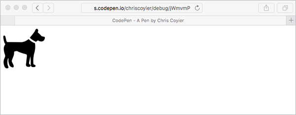
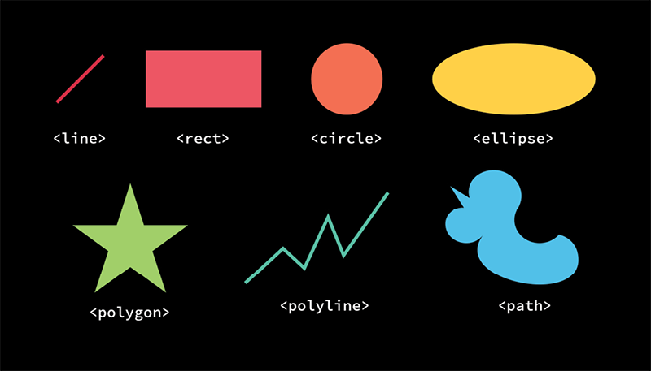

HEY, EVERYBODY! Let’s be honest. Look how short this book is. We don’t have much time together. I think it’s best if we get started on our little adventure with SVG right away.

Here’s how easy it can be to use SVG (FIG 0.1):

```

```

No joke!

Confession: I was aware of SVG’s existence for years before I realized that was possible, in part because early implementations of SVG required the `object` or `iframe` element. SVG support on the HTML `img` element came much later (and with caveats).

Where did this `dog.svg` file come from, though? Well, the Noun Project is a particularly great source of such images ([http://bkaprt.com/psvg/00-01/](http://bkaprt.com/psvg/00-01/)). There are lots of other places online to get your hands on vector graphics, too. Pretty much all stock photography sites let you filter search results by “vector,” which is exactly what you need for SVG.

When downloading from the Noun Project, you have the option of downloading the PNG or SVG version. If you download both, you’ll wind up with two files:

```
icon\_364.png
icon\_364.svg
```

They’re both the same image of a dog. If you link to either of them from an `img` tag, you’ll get the same image of the same dog. So what’s the difference?

One important difference is file size. The PNG version is 40 KB and the SVG version is 2 KB—literally twenty times smaller! We’ll come back to this later.

But the main difference is the file format itself. PNG (like its GIF and JPG cousins) is a *raster* image format. (Raster images are also sometimes called *bitmap* images; although the terms are largely interchangeable, we’ll use “raster” for the purposes of this book.) Think of a raster as a grid of pixels. The difference between raster formats is largely about how that grid of pixel information is compressed. This is all tremendously nerdy, but the common denominator is: *pixels*.



SVG is different. Think of SVG as a set of instructions for drawing shapes. In fact, this is not a metaphor or abstraction: SVG is literally a set of instructions for drawing shapes. I don’t think you can write a book about SVG without saying this, so let’s get it out of the way: SVG stands for *Scalable Vector Graphics*. “Vector” is the key word here. Think geometry: points, lines, curves, polygons. The instructions in SVG read something like this: “Go to such-and-such coordinate; draw a rectangle that is so tall and so wide. Or draw a line, or an ellipse, or follow some more complex instructions and draw the Coca-Cola logo.”

Because SVG images are just sets of drawing instructions, they aren’t tied to any particular pixel dimensions. Our 
`dog.svg` is happy to be displayed at 100 pixels wide or 2000 pixels wide. The exact same file will be equally *visually crisp* at any size. How excellent is that? I’ll answer for you since this is a book and not a chat room, sheesh. *It’s very* *excellent.*

This is in stark contrast to raster images, whose file size goes up dramatically the larger the dimensions get. Imagine doubling the size of an image from 100 by 100 pixels to 200 by 200 pixels, as is recommended to ensure that a raster graphic remains visually crisp on a display with twice the pixel density (or what Apple calls a “Retina” display). Remember: that’s not *twice* as much pixel data; it’s *four times* as much. Four times as much data being sent across the network. Four times as much memory used to display it. Four times the bandwidth.

And Retina-style high resolution displays, which are around 2x normal pixel density, are only the beginning. The pixel density of screens keeps increasing. The screens look great, but they pose a huge challenge to building for the web. As designers, we simply can’t quadruple the size of our sites—at least not without serious implications, like losing impatient customers to slow load times, or excluding users altogether.

Raster image bloat has become such a problem that we’ve invented new HTML elements and attributes—by which I mean `img srcset` and `picture`—to deal with it. With these newcomers, we’re able to prepare and specify multiple images, and the most appropriate one will be used by the browser for the current screen. That’s a book in itself; in fact, Scott Jehl’s *Responsible Responsive Design* goes into much more detail about these two elements than I can here ([http://bkaprt.com/psvg/00-02/](http://bkaprt.com/psvg/00-02/)). Often, a single SVG image will work as the most appropriate choice for any screen, which keeps things simple.

Let’s review what we know about SVG so far:

* SVG can have a smaller file size than a similar raster image.
* SVG can be scaled to any size.
* Infinite scalability means that SVG looks crisp at any size.

Pretty compelling, right?

Let’s add one more item to that list: SVG is supported in all modern browsers, both mobile and desktop, at least three versions back. So why the sudden resurgence of interest in SVG? Because even though SVG itself is fairly old in web years, this level of ubiquitous support is fairly recent.

In 1998, when SVG was introduced, bandwidth was the big concern; an episode of *The Web Ahead* with Jen Simmons and Doug Schepers talks about this ([http://bkaprt.com/psvg/00-03/](http://bkaprt.com/psvg/00-03/)). Most people used dial-up modems to access the internet; less than 3% had broadband ([http://bkaprt.com/psvg/00-04/](http://bkaprt.com/psvg/00-04/)). Sending drawing instructions across the network was a very appealing idea, since it would be much faster than sending actual graphics.

Today, we’re still worried about bandwidth, mainly because of the often slow network connections of mobile devices. We’ll get into the nitty-gritty of browser support (and what you can do for older browsers without support) later.

For those of you raising your WELL ACTUALLY index fingers, *en garde*! There are caveats to a lot of this. I’ll attempt to cover all of them as we go along.

## THE SHAPES OF SVG

This isn’t going to be a book that dives deep into the SVG syntax, but it’s worth being aware of the SVG elements that draw actual shapes. There are surprisingly few of them (FIG 0.2).



That’s it! All of these except `path` are considered “basic shapes.” `path` is unique because it can draw anything, including any shape the other elements can draw. In fact, under the hood, all the other shapes are just a convenient syntax for a path—syntactic sugar, as they say. Drawing only gets slightly more complicated when you factor in fills, strokes, masks, and filters. But this is pretty much all SVG has to work with for drawing things. That doesn’t mean it’s limited, though; these are fundamental elements of design in any two-dimensional medium.

In fact, whether you realize it or not, I bet you’re already pretty good at knowing when you’re looking at an image made from these shapes.

## YOUR VECTOR INTUITION

While SVG might be somewhat new to you, I suspect that you can already intuit whether an image is *vector* or *raster*. Which of the two bear images in FIG 0.3 is a vector graphic?


It’s the one on the left. Easy, right? It looks like it was drawn from mathematical curves and shapes, and in fact it was. Here’s another. Which one of the bears in FIG 0.4 is vector?


TRICK QUESTION. They are both vector. That crisp, cartoony look tells us this is a vector graphic. They are both a bit more complex than the vector bear from FIG 0.3, though. The file size probably won’t be trivially small, especially for the shaded teddy bear on the right. Let’s think about this for a second.

For the most part, if a graphic is vector, it should be in SVG format for use on the web. It will look better, be more efficient, and open up interesting design possibilities (which we’ll cover in this book). If a graphic is raster, it should be in PNG or JPG format for use on the web. Or, if it’s animated, in GIF format. Or WebP, a wonderful new format that is the most efficient of its kind but, like SVG, may require a fallback ([http://bkaprt.com/psvg/00-05/](http://bkaprt.com/psvg/00-05/)). These formats are still the most appropriate choice. SVG isn’t meant to replace raster graphics, unless they are being used to display a graphic that should have been vector to begin with.

The only time this rationale breaks down is if a vector image becomes *too complicated*, and consequently the file size of the SVG becomes too big to be practical. Does the image consist of three combined circles? That’s about as simple as it gets. Is the image an oak tree with hundreds of detailed leaves? That means a lot of complexity and therefore a large file size. Sometimes it’s cut and dried (either use SVG or don’t); sometimes it’s more ambiguous. Your best bet is to test the file size both ways, gauge how important SVG’s features are to the situation, and make the call. But remember: if you choose raster, hang on to that original vector source file in case you need to edit it and save a new raster version later!

SVG can also *contain* raster graphics. That may seem a bit weird at first, but it makes more sense when you think of SVG as a set of instructions: draw this thing over here, put this text over there, place this image back here. It makes SVG a good choice for graphics that mix vector and raster artwork.

Now that we know what some of SVG’s benefits are, where to find SVG images, and when the SVG format is most appropriate, let’s turn to how to actually use it on the web. We’ve really jumped right in here, haven’t we? I didn’t want to linger too long in the shallow end of the pool. If you’re a complete beginner, I hope you’ll stick with me and push yourself to learn more.
