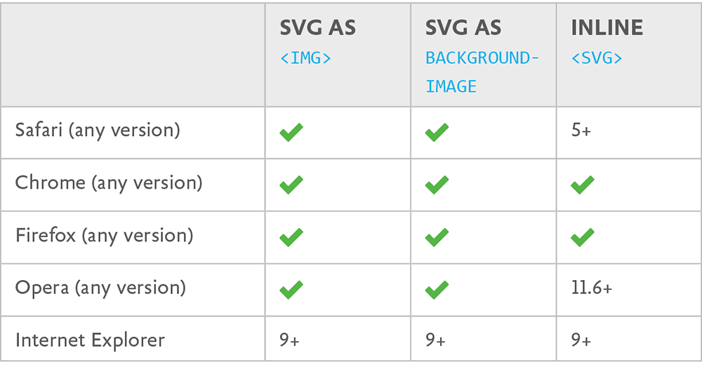
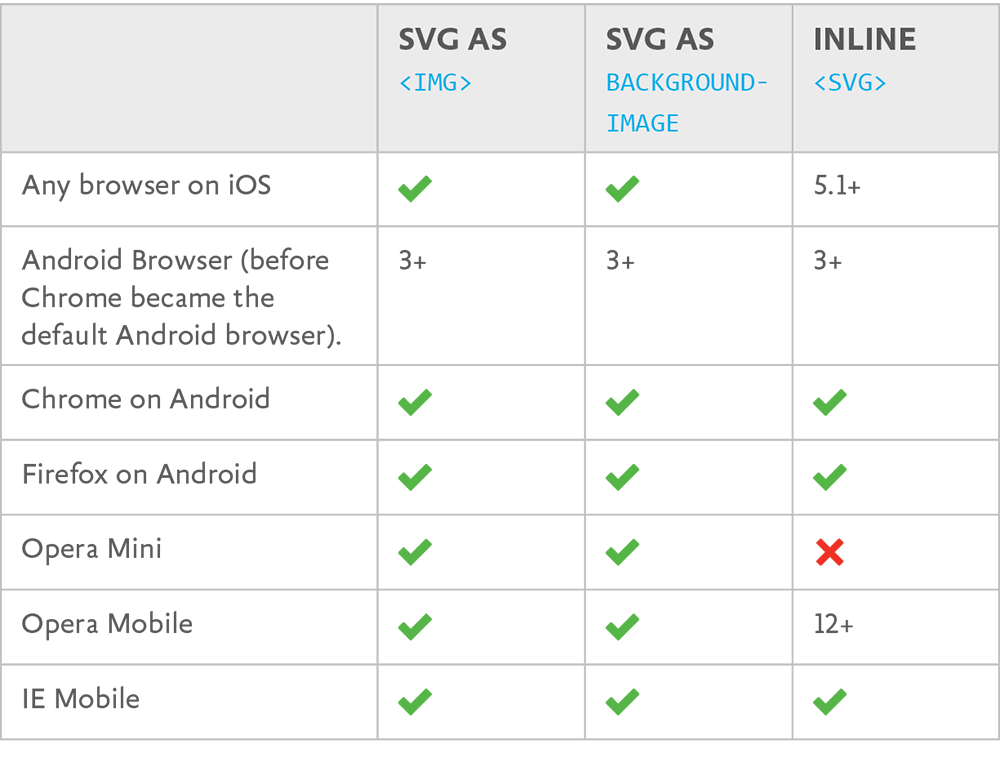

I WANT TO COVER all of the different ways we can use SVG on the web right away so that it doesn’t feel so mysterious. There are three primary ways, each of which can be useful.

## SVG AS HTML img

We already covered this one. You can use SVG images in HTML like this:

```

```

Here we’re using `img` with SVG just as we would with any other appropriate image format (like JPG, GIF, or PNG): to display an image within content.

In FIG 1.1, the leaf itself is part of the content of the article. A _content management system_ (CMS) could conceivably produce leaf pages like this, the leaf image being part of the content unique to that page.

Now imagine that that same CMS also automatically creates a weekly newsletter of newly-added leaves to send to members of the site. The newsletter uses a new type of template, but the content is the same. The image of the leaf should appear wherever that content goes. That’s a _content image_, and a perfect use for SVG-as-`img`.

.")

## SVG AS CSS background-image

CSS plays well with SVG, too. It goes like this:

```
.main-header {
   background-image: url(header-bg.svg);
}
```

Here, you use SVG just as you would background images in any other appropriate file format: as part of the design of a page. In this case, the image itself isn’t considered content.

In FIG 1.2, that spiky separator between the header and the content is a very small, repeating SVG image. Is it a nice visual element for the site? Yep. Is it a good use for SVG because it’s small, scalable, and visually crisp? Yep. Is it _part of_ the content? Nah.

.")

Imagine this is another blog post in our hypothetical CMS that sends out the weekly newsletter. This imaginary newsletter is just a way for us to think about what content _is_ and the different ways in which it might be reused. But you can still _design_ a newsletter. RSS is another story. When content is syndicated, you likely have no control over how that content is presented, aside from some barebones HTML. Would that spiky separator need to go out in the newsletter? Probably not. It isn’t required for the content to make sense. So this isn’t a content image; it’s an image that is part of a template and part of the design applied to that template. This is a perfect time for SVG as CSS `background-image`.

## INLINE SVG

Another way to use SVG is to drop it right into the HTML, hence the moniker “inline” SVG. Simply open up a .svg file in a text editor, copy all the code, and paste it into the HTML where you want that image to be. Like this:

```
<h1>Hey, there’s an SVG image below me!</h1>
<svg viewBox="0 0 100 100">
   <rect x="10" y="10" width="100" height="100" />
   <!-- and all the shapes you need! -->
</svg>
```

SVG is right at home in HTML, because they are both markup languages (you know: angle brackets with tags, attributes, and familiar stuff like that). While SVG is a stand-alone image format, browsers that support SVG will parse this SVG and render it right within the HTML document. A document within a document!

This is a particularly compelling way to use SVG because:

- You can style the individual shapes with CSS, the same CSS you use for the rest of your site.
- You can affect the shapes with JavaScript, the same JavaScript you use for the rest of your site.
- The page doesn’t need to make a network request for the image.
- You can make copies easily via the `use` element. (We’ll cover that later.)
- You can handle accessibility as well as (or better than) you can with other methods through the use of proper accessibility-focused tags and ARIA attributes.

SVG and all of its descendant shapes are “in the DOM,” as they say. This means that you have the same access and control over them that you would over a `div` or `h3` or any other element. We could give our robot pretty red kneepads in CSS, have it talk when you click its mouth, dance when you hover over it, or just about anything else you can imagine. SVG used as `img` or `background-image` can’t be controlled in this way, nor can it link to any other outside assets, like a stylesheet.

These things are unique to inline SVG, which makes it very powerful and compelling to use. We’ll see inline SVG really sing a little later, when we look at things like building an icon system with it, animating it, and other design possibilities.

Those are the three _primary_ ways you can use SVG on the web. There are a handful of additional ways, including linking to SVG through `object`, `embed`, or `iframe` elements. If you go that route, you retain some of the same interactive possibilities you get with inline SVG, but with the major caveat that everything needs to be embedded in the SVG source itself or linked to independently. Reach for these solutions in situations where inline SVG feels like too much “clutter” in the parent document, or if you need the interactivity or ability to link to other assets and don’t mind the extra network requests. Personally, I find the use cases for these other methods few and far between, so I don’t think we should squander what little time we have together on them.

.")

## BROWSER SUPPORT

Let’s get more specific about browser support. After all, one thing that makes SVG so exciting is the excellent browser support it enjoys. A few notes first, though:

- Even if a given browser doesn’t support SVG the way you want to use it, there’s always a way to handle a fallback. That’s all just part of the job, web buddies. We’ll cover that in Chapter 9.
- SVG support isn’t always _yep_ or _nope_. Even if a browser largely supports SVG, particular features can have quirks. We’ll cover those throughout the book as they crop up.

The tables in FIG 1.4 and 1.5 help explain the browser support situation across desktop and mobile.



### Desktop browsers

SVG fares pretty well on the desktop (FIG 1.4). As you can see, support looks pretty good across browsers—the only one to watch out for is IE 8 (and down).

### Mobile browsers

On the mobile front, things are a little more complicated, but mostly okay. There are far too many mobile browser/platform combos to detail here, so let’s cover the biggest players (FIG 1.5).

The standout problems on mobile are Android 2.3 and down (no SVG support at all) and lack of inline SVG support in Opera Mini.

If you’re interested in testing a specific combination of browser/version/platform yourself, I’ve created a very simple test case ([http://bkaprt.com/psvg/01-04/](http://bkaprt.com/psvg/01-04/)). Also, the website Can I Use… tracks a ton of SVG support information that is worth consulting ([http://bkaprt.com/psvg/01-05/](http://bkaprt.com/psvg/01-05/)).

Before we go too much further, let’s make sure we know how to get our hands on SVG—either by creating it in vector software, or finding it online and working with it in that same software. That’s next.
