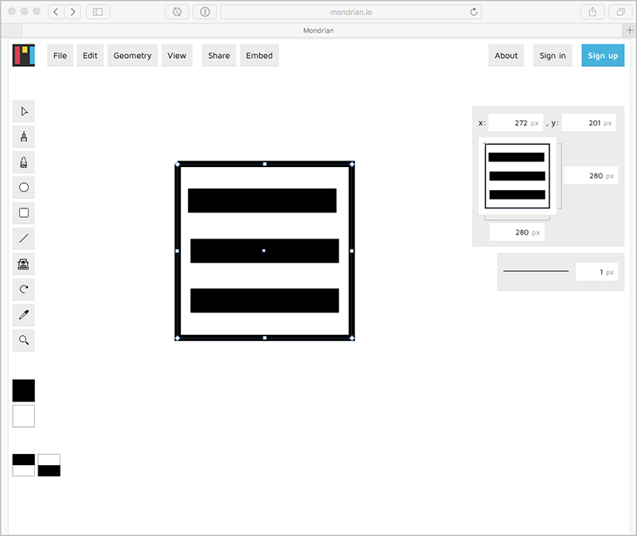

I ONCE HEARD ABOUT A GUY who could look at the source code for SVG and visualize what it drew. (The guy was Doug Schepers, and I heard this on *The Web Ahead*.) I can’t do that and I bet you a nickel you can’t, either. But I think it’s really cool that the source code of SVG is intelligible. You *can* learn it and work with it, and there is some benefit to that.

But you don’t actually have to *design* with the code; you can do that with design software. Fortunately, there is no shortage of software that speaks SVG.

## DESKTOP SOFTWARE

### Adobe Illustrator

Illustrator is the quintessential example of vector-based design software. It has been around forever. You can find tutorials and training materials on it everywhere. It has features galore. It’s available for both Mac and PC for a monthly charge. You might choose Illustrator like you would choose a guitar over a tenor banjo: it’ll be a lot easier to find tutorials, documentation, and teachers for the guitar, because it’s a more common and popular instrument than the tenor banjo.

Most relevant for us: Illustrator speaks SVG natively. You might think of the file format of Illustrator as .ai, but it can also be .svg. And not just in an “Export to SVG” kinda way—it’s a “Save As” native format. (Unfortunately, going that route results in SVG that is not ideal for the web, but we’ll cover how to address that in Chapter 5.)

When relevant, we’ll be using Illustrator as the software of choice in this book, both because it’s the program I know best and because it’s the most widely used.

.")

### Sketch

Sketch is Mac-only software. It has been growing in popularity, seemingly fueled by folks yearning for a fresh take on screen-design software (and those who like the idea of software you just *buy* rather than pay for monthly).

Most relevant for us: it has great SVG exporting features. You designate individual elements (or groups of elements) as “exportable” and then export them. You end up with cropped, immediately useable versions of what you exported. That meshes with a screen-design workflow pretty well, in my experience.

I use Sketch and like it, but if I’m producing a purely vector bit of artwork, I turn to Illustrator. For me, Sketch shines at layouts, and I love that it can output SVG assets from those layouts. But for vector editing, Illustrator wins hands down.

.")

### Inkscape

There are some compelling reasons to use Inkscape. The big one: it’s free and open source. It works on Mac, PC, and Linux. SVG is its native file format. Bonus points: the Inkscape team contributes to SVG spec development.

I feel like a snob writing this, but I find the Inkscape interface disconcerting. On the Mac, it uses X11, which provides an ­emulated non-native interface. This means that the entire UI (windows, menus, etc.) is not the normal operating system UI that Mac users (ahem, me) are used to </snob>. I hear on Linux it feels perfectly natural, and pretty close to natural on Windows.

.")

## MOBILE SOFTWARE

### Autodesk Graphic

Graphic is a complete vector-editing app for iOS. As I was trying it, I was highly impressed that it featured all the tools and capabilities of desktop OS vector-editing software. It was a bit hard for me to get used to not having the fine-grained pointing abilities of a mouse, but that’s likely just lack of practice. I imagine a skilled, pen-wielding artist might find having an interactive surface like the iPad pretty compelling.

## WEB SOFTWARE

.")

### SVG-Edit

Surely you could dig around and find little features that this app doesn’t have, but it *does* have a surprising amount—like a layers system that allows you to put elements on top of (or below) other elements. Layer stacking can be tricky in SVG, since it doesn’t have a native stacking system like `z-index` in CSS. Instead, SVG relies on source order: whichever elements come later in the source code are on top. SVG-Edit’s layer system abstracts away this source-order shifting ([http://bkaprt.com/psvg/02-04/)](http://bkaprt.com/psvg/02-04/).

### Method Draw

Method Draw is based on SVG-Edit ([http://bkaprt.com/psvg/02-05/](http://bkaprt.com/psvg/02-05/)). It has a simple, clean, and well-considered design with some pretty great UI controls. Anything number-related is click-and-draggable, which makes for easy alterations to things like rotation, blur, and opacity ([http://bkaprt.com/psvg/02-06/](http://bkaprt.com/psvg/02-06/)).

### Mondrian

Mondrian is an open-source project that offers a similar set of features as the others ([http://bkaprt.com/psvg/02-07/](http://bkaprt.com/psvg/02-07/)). One nice perk: it stores what you are working on automatically. When I came back to Mondrian after a hiatus of several weeks, the icon I was working on in FIG 2.5 was waiting for me ([mondrian.io](http://mondrian.io/)).

It’s great to see powerful, interactive, fast SVG software right in the browser. All three of these are free and open source. It’s impressive stuff.

We now know a bit about the SVG format and how to use it on the web; we know about software that makes working with SVG easier and more practical. Now let's get into *actually* using it. SVG can help us with some of the crucial everyday work we do as front-end developers. It can solve real pain points and real problems—like how we create and implement icons on our sites.

