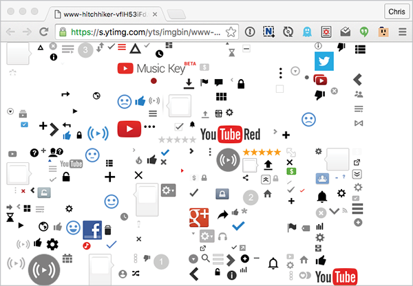
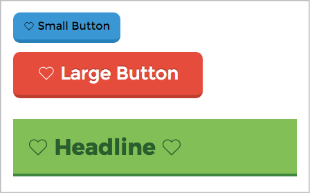
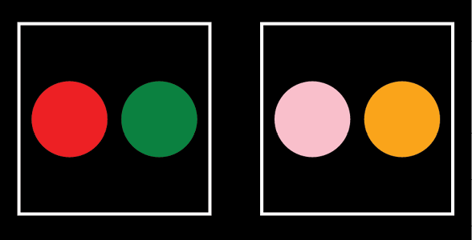
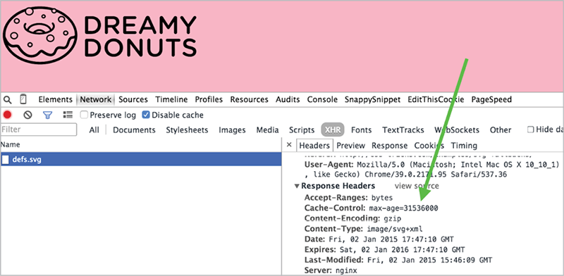
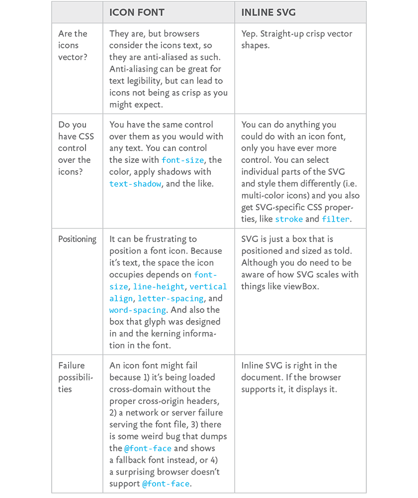

WE’VE BEEN USING ICONS on websites since the dawn of...websites. Styles come and go, but the functionality of icons is here to stay. They aid in quick visual differentiation and assist in conveying meaning—even across languages and cultures.

Take a look at a fairly simple page on [GitHub.com](http://GitHub.com) (FIG 3.1).

All told, nearly two dozen icons there.

We *could* make each of those icons an image, like 
icon\_pencil.svg, and use them in our HTML like this:

```
`<``li>`
  <a href="">
    
```

That works. There is nothing inherently wrong with using `img`. But it does mean that each unique image is a separate network request. That is, when a browser sees an `img` tag, it goes across the network to get that file and display it. The same is true for background images in CSS: every unique image referenced is a separate network request.


When thinking about web performance, one of the first things to look at is reducing the number of network requests (sometimes called “HTTP requests,” the protocol of the web—we’ll call them network requests here). See Scott Jehl’s *Responsible Responsive Design* or Lara Hogan’s *Designing* *for Performance* ([http://bkaprt.com/psvg/03-01/](http://bkaprt.com/psvg/03-01/)) for more on this.

Ideally, we could make *all* of our icons a single network request. That’s one ingredient in building an icon system. And really, there are only two ingredients:

* Serve icons as a single resource to make a website faster.
* Make the system easy and convenient to use.

In fact, as front-end web development has been maturing, we have been solving this problem over and over again. Reducing the number of requests boosts performance to such an extent that we're almost always willing to complicate development work in exchange. This is especially true on mobile, where latency is so much higher ([http://bkaprt.com/psvg/03-02/](http://bkaprt.com/psvg/03-02/)).

One classic way to tackle an icon system—cleverly cribbed from video game development—is with CSS sprites. A CSS sprite is one big raster image with lots of smaller images placed onto it; YouTube puts this to effective use (FIG 3.2).



One big image means just one network request. To display one of the smaller images (like a single icon), we would make an element the exact size of the icon, use the large sprite image as the background-image in CSS, and then adjust the 
`background-position` to reveal only the smaller image.

The method is clever and effective. We can do the same thing with SVG: lay out a bunch of vector graphics on a single artboard, export it as one big SVG file, and do the same background shifting trickery.

But as long as we’re going the SVG route, there’s an even better way. Let’s go through building an inline SVG system step by step so you can see how it works.

We’re working inside one big SVG, so we’ll start with this:

```
<svg>
</svg>
```

Between the opening and closing tags, we’ll put the paths that do the actual drawing:

```
<svg>
  <!-- this draws the Twitter logo, one shape -->
  <path d="">
  <!-- this draws the CodePen logo, two separate shapes -->
  <path d="">
  <path d="">
</svg>
```

Then we’ll wrap those paths in `g` tags. The `g` tag in SVG is like a `div` in HTML: it doesn’t do much by itself other than group the things inside it. It’s mostly useful for referencing and applying styles that can affect everything together.

```
<svg>
  <g id="icon-twitter>
    <path d="">
  </g>
  <g id="icon-codepen">
    <path d="">
    <path d="">
  </g>
</svg>
```

Then we’ll wrap all of that in a `defs` tag. A `defs` tag essentially says, “SVG, don’t try to actually draw any of the stuff inside this tag; I’m just defining it to use later.” The SVG element itself will still try to render, though, so let’s make sure it doesn’t do that by shrinking it to nothing. Using `width="``0"` and `height="0"` or `display="none"` is better than using CSS to hide the SVG; CSS takes longer to process, and `style="display: none;"` can have weird consequences, like failing to work at all on some iOS devices ([http://bkaprt.com/psvg/03-03/](http://bkaprt.com/psvg/03-03/)).

```
<svg width="0" height="0" class="hide">
  <defs>
    <g id="icon-twitter">
      <path d="">
    </g>
    <g id="icon-codepen">
      <path d="">
      <path d="">
    </g>
  </defs>
</svg>
```

The chunk of SVG we’ve just built is our SVG icon system. We’re going to be talking about this chunk of SVG a lot in this book, so let’s give it a name: an *SVG* *sprite*.

As long as this SVG sprite is present in the HTML of our page, we can do this anywhere we want to draw one of those icons:

```
<svg class="icon icon-twitter" viewBox="0 0 100 100">
  <title>@CoolCompany on Twitter</title>
  <use xlink:href="#icon-twitter" />
</svg>
```

This code snippet will draw that icon onto the page, just like an `img` would. One new thing here is the `viewBox` attribute, which we’ll get to soon. The other new element is `use xlink:href`, which essentially says, “Go find the chunk of SVG that has this ID and replace me with a clone of it.” That’s a beautiful thing right there. We can use `xlink:``href` to draw any bit of SVG anywhere we like and repeat it as many times as we want without repeating actual drawing code.

You can see this in action in the footer on a previous design of CSS-Tricks, which had a `use`\-based icon system (FIG 3.3).

. Note the repetitive shapes.")

These icons are properly accessible. They are nicely semantic. And—perhaps best of all—we can size, position, and style them easily.

```
.icon {
  /\* make it match the font-size \*/
  width: 1em;
  height: 1em;
  /\* make it match the text color \*/ 
  fill: currentColor; 
}
```

These values are a pretty cool little trick! Instead of explicitly styling the SVG, we make it size and color itself to match the font properties. If we drop that SVG into a `button`, it will absorb the styles already happening in that button and style itself accordingly (FIG 3.4).



## USING symbol

We can improve this setup a bit, though. There is another element in SVG that is perfect for icons: `symbol`. Think of `symbol` as “SVG within SVG.”

Did you notice how we declared a `viewBox` on the `svg` where we drew the Twitter icon? That `viewBox` is specific to that Twitter icon. It defines the area in which that shape is drawn. It is essentially the coordinate system for the points and the aspect ratio. A `viewBox` whose value is `"0 0 100 100"` is really saying, “The grid starts at 0, 0 and goes to 100 along the x-axis and 100 along the y-axis.” And that has to be correct for each icon, or it won’t draw correctly.

We also used a `title` attribute to make sure we had basic screen-reader accessibility covered. We can shift the responsibility for both `title` and `viewbox` to the `symbol` element. Plus, SVG already knows not to draw `symbol` elements; it knows you are just defining them to `use` (actually draw) later.

Our chunk of SVG where we build the icon system now looks like this:

```
<svg width="0" height="0" class="visually-hidden">
  <symbol id="icon-twitter" viewBox="0 0 100 100">
    <title>@CoolCompany on Twitter</title>
    <path d="...">
  </symbol>
  <symbol id="icon-codepen" viewBox="0 0 200 175">
    <title>See Our CodePen Profile</title>
    <path d="...">
    <path d="...">
  </symbol>
</svg>
```

And then, when we go to draw the icon somewhere on our page, we can *do less* and *avoid a lot of repetition* if the icon is used in multiple places:

```
<svg class="icon icon-twitter">
  <use xlink:href="#icon-twitter" />
</svg>
```

The result is exactly the same as with the initial snippet; it’s just easier and less error-prone when implementing. In the second, the `use` element will draw the icon with the correct `viewBox` dimensions taken from the `symbol` element. We don’t have to manually deal with `viewBox` anymore. Plus, the final `svg` in the document will contain the correct `title` and `desc`. See? Very awesome.

This still might look like a lot of code just to draw an icon, but it’s comparable to any other icon-drawing technique, especially when you consider what you get from this method. Semantically, our markup says, “This is an image icon.” Screen readers can announce whatever we want them to (“@CoolCompany on Twitter,” for example), or nothing at all if that’s more appropriate. We also get resolution independence. We get the ability to style the icon through CSS, and every other advantage of inline SVG, because that’s exactly what we’re using. Imagine trying to get all that functionality from, say, icon fonts—it would be difficult for some features and impossible for others!

Let’s look at another example of real-world usage. The curvy tabs on a previous design of CSS-Tricks would have been difficult to do in CSS without substantial trickery (FIG 3.5). And speaking of trickery, I’ve seen some pretty over-the-top demos of drawings using just HTML and CSS. There is, of course, nothing wrong with a good bit of fun and experimentation, but I usually can’t help but think, “You know, this is what SVG is for.”

With inline SVG, we just define that shape as a `path` once, make it a `symbol`, and `use` it over and over as needed, even altering the style. And even though we were talking about an icon system here, note that this idea works for *any* SVG you want to use as part of a system.


## A NOTE ABOUT use AND CSS STYLING

Let’s say you have a `symbol` with two `path`s in it. Each `path` has a class, like `.path-1` and `.path-2`. In your CSS, you can target and style those with no problem.

```
.path-1 {
  fill: red;
}
.path-2 {
  fill: yellow;
}
```

You can use the `symbol` wherever you like:

```
<svg class="icon">
  <use xlink:href="#my-icon" />
</svg>
```

Now say you’d like to create a variation on the normal styling. So you use the `.path-1` class on the `svg` as part of the selector.

```
.icon .path-1 {
  fill: green;
}
```

Sadly, that doesn’t work. `use` is kind of magical in that it clones the elements inside the `symbol` and moves them into what is called the Shadow DOM. You can look at the Shadow DOM by using the developer tools in the browser (FIG 3.6).


I don’t want to take us down a rabbit hole, but the Shadow DOM forms a boundary that CSS selectors don’t go through. This may be remedied in the future. I’ve seen no less than three ideas presented on how CSS selectors might be able to penetrate the Shadow DOM. But for now, there’s no good way to do variations on the same `symbol`—it’s best just to create another copy and style it differently. GZIP will be your friend there, as it does a great job of compressing repetitive text.

There’s a trick for getting two configurable colors per `use`, though. Imagine this symbol:

```
<symbol id="icon">
  <path d=" … " />
  <path fill="currentColor" d=" … " />
<symbol>
```

We’ll use it more than once:

```
<svg class="icon icon-1">
  <use xlink:href="#icon" />
</svg>
<svg class="icon icon-2">
  <use xlink:href="#icon" />
</svg>
```

The first `path` has no fill of its own. It will default to black unless its parent `svg` has a fill set, in which case that color will cascade down to it. That’s color number one. With the second path, we’ve used the keyword `currentColor` for the fill (you could do this from CSS as well). Whatever `color` you set on the parent `svg` will be used for the fill on it. That’s color number two.

It goes like this:

```
.icon-1 {
  fill: red;       /\* Color #1 \*/
  color: green;    /\* Color #2 \*/
}
.icon-2 {
  fill: pink;      /\* Color #1 \*/
  color: orange;   /\* Color #2 \*/
}
```

I intentionally took a roundabout way to get here. Sorry about that! I wanted to sneak in some practical SVG learnin’. `symbol` is definitely the way to go when building an SVG system.



## WHERE DO WE PUT ALL THOSE symbols?

Our SVG sprite will work great if we put it in the HTML. It won’t show up visually, and we’ll easily be able to use all the icons it contains.

Often, we work with HTML in the form of templates—perhaps our CMS gives us template files to work with, or we’re using some other framework that compiles templates into the final HTML output. Dropping a large chunk of SVG code in our templates may feel unwieldy or messy. There is likely some way to “include” the SVG in that template, making things more manageable. So where do you put that “include”?

Well, putting the SVG sprite at the top of the document (that is, right after the opening `body` tag) is the least buggy way to proceed, because some browsers (like Safari on iOS 8.1) won’t render the `use` at all if the sprite is defined after it. That’s a shame, because putting the sprite at the bottom of the document would be better for performance, in the spirit of “deferred loading” of things deemed less important than the primary content.

Also, using `file``_get_contents()` is safer than `include()` in PHP, as XML like `<?xml` will have trouble going through the PHP parser. Say you’re using PHP:

```
</head>
<body>
  <!-- include your SVG sprite here -->
  <?php echo file\_get\_contents("svg/sprite.svg"); ?>
  ...
  <!-- use your sprite, here -->
  <a href="/" class="logo">
    <svg class="logo">
      <use xlink:href="#logo" />
    </svg>
  </a>
```

The advantage of doing it this way is that there are *zero* network requests for the icons. That’s pretty nice!

But there are a couple of downsides to this approach. It isn’t perfectly compatible with server-side HTML caching. If the site does that, every single page will have this identical chunk of SVG in it, which isn’t very efficient (“bloated” cache, you could call it). Plus, browsers will need to read and parse that whole chunk of SVG with every single page load, before it gets to the (arguably more important) content below.

Including the sprite server-side also doesn’t take advantage of browser caching very well. Browser caching happens when a browser holds onto a file so a network request doesn’t need to be made for it. If we move our chunk of SVG into a separate file, we can tell the browser to cache it, and we’ve solved both problems.

We can make sure the browser caches the sprite by putting the file path in the `xlink:href` attribute of the `use` element. That’s right, it doesn’t have to be just an `#identifier`; it can be a file path (or *external source*):

```
<svg class="icon icon-twitter">
  <use xlink:href="/svg/sprite.svg#icon-twitter" />
</svg>
```

To ensure the file is cached by the browser, you could put this code in the site’s `.htaccess` file (assuming an Apache server):

```
\# Ensure SVG is served with the correct file type
AddType image/svg+xml .svg .svgz
\# Add browser caching to .svg files
<IfModule mod\_expires.c>
  ExpiresActive on
  ExpiresByType image/svg+xml "access plus 1 month"
</IfModule>
```

Remember that if you alter the icons in any way, you’ll need to make sure fresh copies are used, not the stale ones in the cache. One way to do that is to use a URL parameter on the file path, making it look like a different file to the browser. I use a simple system like this sometimes:

```
<?php $version = "1.2"; ?>
<svg class="icon icon-twitter">
  <use xlink:href="/svg/symbols.svg?version=<?php echo $version; ?>#icon-twitter" />
</svg>
```

You can get as clever with that as you want to, but the basic concept holds true. Don’t write this one off as too much work! Remember that network requests are slow, so browser caching is one of the most effective ways to speed up a website.

There’s something you need to keep in mind when it comes to `use` with an external source: the cloned elements no longer share the same DOM, the way they do with internal references. You’ll be able to inspect the Shadow DOM and it will appear the same, but you can’t, for instance, style a path directly from CSS on the parent document, or `querySelectorAll` for an element from JavaScript on the parent document. You would have to do those things from inside the external source itself. You can, however, apply a fill color to the parent `svg` and have that cascade through the other elements and work, so `use` with an external source is still pretty great for icon systems.

## THE FUTURE: FRAGMENT IDENTIFIERS AND HTTP/2

You know how we’ve been referencing icons in the `use` element with the hash symbol, like `#icon-``twitter`? That’s a *fragment identifier*. Fragment identifiers are so useful that they are essentially the basis for this entire icon system trip we’re on. But SVG fragment identifiers are coming to HTML and CSS as well!

For instance, in an image tag in HTML:

```

```

Or in a `background-image` in CSS:

```
.logo {
  background: url("sprite.svg#logo(viewBox(0,0,32,32))");
}
```

Support for fragment identifiers used this way in HTML and CSS isn’t quite here. If it were, you could base an entire icon system on it, I reckon, as it nicely solves the one-request issue. I delved into the details of fragment identifiers in an article for CSS-Tricks ([http://bkaprt.com/psvg/03-07/](http://bkaprt.com/psvg/03-07/)).

Speaking of one-request, even that is destined to be a relic of the past. HTTP/2, the next iteration of HTTP1.x (which we’re all using now), has many features that will actually encourage leaving individual icons to individual network requests. It’s pretty technical stuff, but, for example, HTTP/2 connections will remain open and multiple; compressed requests can happen in parallel. That means multiple requests aren’t much costlier than single requests, if at all. It also means that icons can be cached individually, so changing a single one doesn’t invalidate the cache on the entire set. Concatenating requests will become a bad idea instead of a good one!

## MAKING use WORK WITH AN EXTERNAL SOURCE

No version of Internet Explorer (and some older versions of WebKit browsers) currently supports file paths in 
`use xlink:``href=""`. These browsers support `use` just fine, but only with inline SVG and fragment identifiers (e.g., `#hash`), not URLs. Luckily, there’s a way around that!

To polyfill this external reference feature (that is, make it work in browsers where it doesn’t), try Jonathan Neal’s SVG for Everybody script ([http://bkaprt.com/psvg/03-04/](http://bkaprt.com/psvg/03-04/)). You could include the script on the page like this:

```
  <script src="/js/svg4everybody.min.js"></script>
</body>
```

More likely, though, you’d concatenate it into the rest of the scripts you’re loading on your site.

The script is tiny (less than 1 KB before compression), simple, and clever. Here’s how it works: it runs a test to see if the current browser doesn’t support externally sourced SVG. If that’s the case, it performs a network request for the SVG and then drops in what is needed, as if we were using straight-up inline SVG. If the browser supports externally sourced SVG, the script does nothing.

Here’s a common example. You put this in your HTML:

```
<svg class="logo">
  <use xlink:href="/svg/sprite.svg#logo" />
</svg>
```

If SVG for Everybody determines that the current browser supports this, it leaves it alone. If SVG for Everybody determines that the current browser does *not* support this, it converts the earlier code into this:

```
<svg class="logo">
  <path id="logo" d="..." />
</svg>
```

The second snippet is more widely supported by browsers.

To perform this sleight of hand, SVG for Everybody tests the browser’s User-Agent string—typically a frowned-upon practice in our field because of how easy it is to screw it up or get the opposite result of what you need. Here’s the test SVG for Everybody runs:

/Trident\/[567]\\b/.test(navigator.userAgent) || (navigator.userAgent.match(/AppleWebKit\\/(\\d+)/) || \[\])\[1\] < 537

The result will be either true or false, generally matching older versions of Internet Explorer and WebKit-based browsers. If it comes back true, the script will do the rest of its magic. I don’t think the test is so offensive in this particular case because:

* A false positive would mean it still works (`use` gets replaced).
* A false negative doesn’t necessarily mean the browser doesn’t support the external linking.

But by no means is it perfect. The false negative scenario can pose a problem sometimes. For instance, Android 3 through 4.2 could benefit from this script, but it returns a false negative, so the script doesn’t do anything. Bummer.

## AJAX FOR THE SPRITE

Another solution is to do an Ajax request for the SVG sprite and drop it onto the page. This is a nice fix, as the SVG sprite can still be browser cached, and it completely eliminates the external asset issue. It’s just a little trickier than you might think.

Elements in the DOM have their own *namespace* that essentially tells the browser how to handle them. SVG and HTML have different namespaces. When HTML is read and parsed by the browser and it finds an `svg` tag, it automatically applies the correct namespace. But if you just append an `svg` tag into the DOM yourself, that SVG won’t have the correct namespace by default, and thus it won’t behave like an SVG element.

To create a new SVG element in JavaScript with the proper namespace, you need to do something like this:

var svgElement = document.createElementNS("www.w3.org/2000/svg", "svg");

That goes for the SVG element and any child SVG element you append.

If we create a normal HTML element, like a `div`, and then append the SVG sprite onto that `div`, the parser will run on it and ensure that everything is namespaced correctly.

So here’s how we can use Ajax for our SVG sprite and add it to the page properly:

```
var ajax = new XMLHttpRequest();
ajax.open("GET", "svg/sprite.svg", true);
ajax.onload = function(e) {
  var div = document.createElement("div");
  div.innerHTML = ajax.responseText;
  document.body.insertBefore(div, document.body.childNodes[0]);
}
ajax.send();
```

Or you can ensure that the response type is a document, which also gets everything in good shape to append, and drop that in without needing the `div`.

```
var ajax = new XMLHttpRequest();
ajax.open("GET", "svg/sprite.svg", true);
ajax.responseType = "document";
ajax.onload = function(e) {
  document.body.insertBefore(ajax.responseXML.documentElement, document.body.childNodes[0]);
}
ajax.send();
```

If you’re using jQuery to help with Ajax, the response will automatically be a document. You need to force that into a string before inserting it into the `div`, like this:

```
$.get("svg/sprite.svg", function(data) {
  var div = document.createElement("div");
  div.innerHTML = new XMLSerializer().serializeToString(data.documentElement);
  document.body.insertBefore(div, document.body.childNodes[0]);
});
```

We can see that the caching is in effect by looking at the Cache-Control header of the XHR request for the SVG file (FIG 3.9). Lookin’ good.

. Shown in OS X Chrome, Windows 7 / IE 9, and Android 4.0 Native Browser.")

## SVG VS. THAT OTHER ICON SYSTEM: ICON FONTS

The reason I’m taking the time to go through all of this is because inline SVG really does make for an awesome icon system. It’s even better, dare I say, than another extremely popular way to approach an icon system: icon fonts. An icon font is a custom font file that you load in CSS through an `@font``-face` declaration; the font’s glyphs are actually icons.

Icon fonts have one distinct advantage over an inline SVG icon system: they are supported in even really old versions of Internet Explorer, which only supports SVG in versions 9 and up. Every other comparable feature between the two comes down squarely on the side of SVG ([http://bkaprt.com/psvg/03-06/](http://bkaprt.com/psvg/03-06/)).

I hate to make this a battle, but hey, let’s make this a battle (FIG. 3.10).

What makes an inline SVG icon system even more persuasive: you don’t have to build that SVG sprite yourself! You can make your computer do it for you. That’s coming up in the next chapter.

We just covered a lot of ground. Think about the inline SVG icon system we reviewed and everything that went into it: All those `symbol` elements that wrap the shapes that draw the icons. The `viewBox` that defines the drawing area for them. Making sure they have unique IDs. Confirming they have accessibility tags that have been done correctly. Hiding the SVG element itself.

If we wanted to, we could do all that work by hand. There’s value in a little elbow grease and hard work, right? No. There isn't. Not when these tasks can easily be handled by a computer. So next we'll look at build tools—automated processes that will make quick work of these things and simplify our lives as developers.
