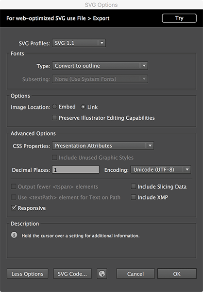
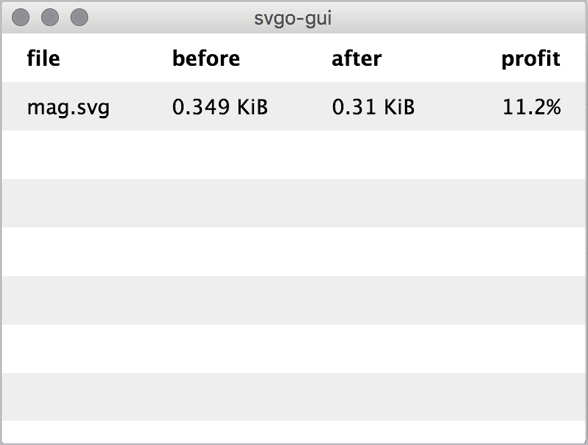
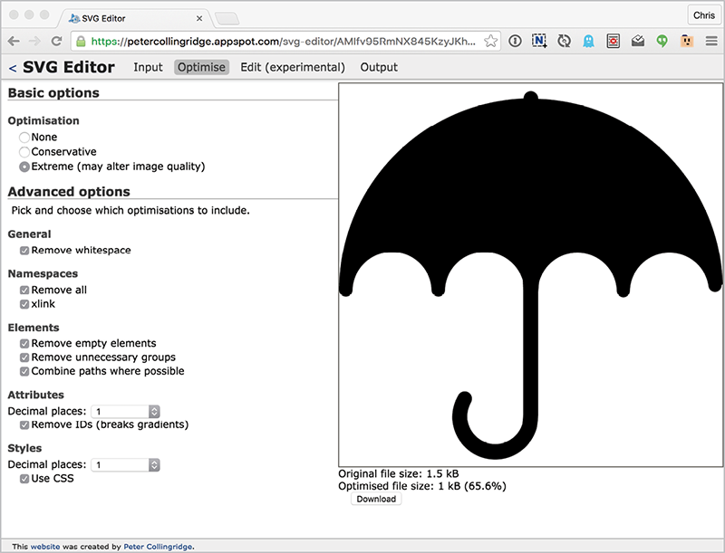
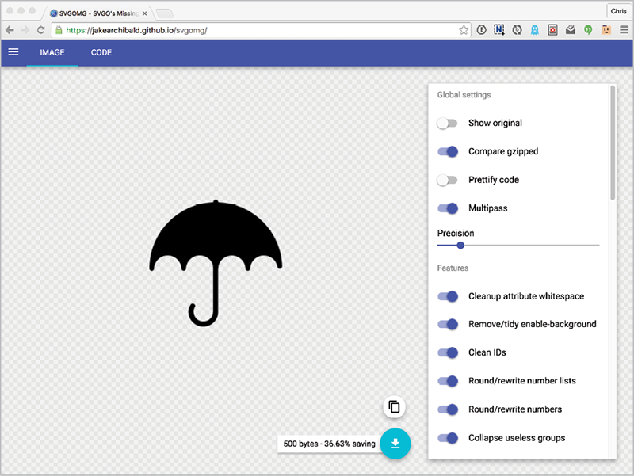

I’VE YET TO COME ACROSS any editing software capable of exporting SVG that is perfectly optimized for use on the web. That’s a little strange, since the primary destination of SVG is the web. But SVG software has other things to worry about, too—like having compelling features for designers, and ensuring that you can open the files you created in the exact same condition in which you left them.

Imagine a guide in Adobe Illustrator: you know, one of those pale blue lines that help you position things on the canvas. There is no concept of a guide in the SVG syntax, but you’d hate to lose those guides every time you saved an SVG document in Illustrator. So, if you export an SVG from Illustrator and leave the “Preserve Illustrator Editing Capabilities” box checked, there will be some extra code in there defining where your guides go. In fact, there will be a *lot* of extra code in there, and it’s so proprietary that it may as well not be SVG at all. However, if you want to make sure that the document opens in exactly the same condition you left it in, leaving that box checked is a good idea.

A typical SVG workflow involves doing the design work in what you might think of as a master-editable version of an image, and then exporting and processing an optimized version to use on the web. Having a file-naming convention (icon\-menu-master.svg and icon-menu.svg, say) or keeping the versions in separate folders is a good way to stay organized as you work.

In short:

* Always save a development version.
* When saving a file to use on the web, export a *copy*.

Let’s continue using Adobe Illustrator as an example. If we were working on a new SVG master image and saving it for the first time, we would select “Save As...”, choose “SVG” as the file format, and then confront a slew of options.

The options in FIG 5.1 are what I would recommend for saving a master document. Remember: this file isn’t intended for web use; it’s intended to be a perfect copy, with all your designer conveniences left intact.



When it’s time to export a copy you intend to use on the web, use File > Export and save a copy under a different name. You’ll get a far more streamlined set of options (FIG 5.2).

I would recommend these options for most cases. This new copy will have a far smaller file size and is nearly ready for web use. It actually *is* ready for web use; it’s just still not as well optimized as it could be. We’ll look at some options for further optimization shortly, but first let’s understand what SVG optimization actually does.

Below is some example SVG output from Illustrator. I should mention that during the creation of this book, both Illustrator and Sketch made huge strides in the quality of their SVG exports. The code shown here is an older example of code exported from Illustrator. It still serves as a good example for us, though, and there are lots of reasons you may continue to run into code like this. For instance: you may have an older version of Illustrator; this sort of code could appear in SVG you download from the internet; or you may be using different software that exports to SVG in a similar way.


Strikethrough text indicates code that is useless on the web and can safely be deleted:

```
<?xml version="1.0" encoding="utf-8"?>
<!-- Generator: Adobe Illustrator 18.1.1, SVG Export Plug-In . SVG Version: 6.00 Build 0)  -->
<!DOCTYPE svg PUBLIC "-//W3C//DTD SVG 1.1//EN" "http://www.w3.org/Graphics/SVG/1.1/DTD/svg11.dtd">
<svg version="1.1" id="Layer\_1" xmlns="http://www.w3.org/2000/svg" xmlns:xlink="http://www.w3.org/1999/xlink" x="0px" y="0px"
 viewBox="0 0 300 200" enable-background="new 0 0 300 200" xml:space="preserve">
<rect x="45.7" y="49.3" fill="#FFFFFF" stroke="#000000" stroke-miterlimit="10" width="36.44237" height="34.23123"/>
</svg>
```

Even more of that code could probably go. I’m sure Illustrator does things the way it does for a reason, but that doesn’t mean we shouldn’t try to trim the fat. Remember: the smaller the file we serve, the faster it will be—and fast is good!

We could clean all of this up by hand, but this is stuff that lends itself to automation very well. And fortunately for us, there are some great optimization tools already out there.

## SVGO

The leading project in automated SVG optimization is SVGO ([http://bkaprt.com/psvg/05-01/](http://bkaprt.com/psvg/05-01/)). It’s a Node.js-based command line tool. Meaning:

1. You have to have Node.js installed to use it—it only takes a second to install ([nodejs.org](http://nodejs.org/)).
2. You use it by typing commands into the terminal. For instance, `svgo dog.svg dog.min.svg` will optimize 
dog.svg into a new file, dog.min.svg (thus preserving the original). The terminal command `svgo -f .` will optimize the entire folder of SVG images you’re currently in.

If we ran SVGO on the example SVG file we just showed, we would get this:

<svg xmlns="http://www.w3.org/2000/svg" viewBox="0 0 300 200" enable-background="new 0 0 300 200"><path fill="#fff" stroke="#000" stroke-miterlimit="10" d="M45.7 49.3h36.4v34.2h-36.4z"/></svg>

65.5 percent smaller! (SVGO calls it “65.5 percent profit,” which I love.)

## INTEGRATING SVGO INTO GRUNT

Developer Sindre Sorhus has created a Grunt plugin for SVGO called grunt-svgmin ([http://bkaprt.com/psvg/05-02/](http://bkaprt.com/psvg/05-02/)). Remember how, when we were using Grunt to build our icon system in the last chapter, any file we changed in our svg folder would instantly trigger the svgstore task and build our SVG sprite? Now, let’s alter that to first *optimize* the SVG, and *then* build it into a sprite.

Since we already have Grunt set up, we’ll run the following from the command line at our project’s root folder to install the plugin:

npm install --save-dev grunt-svgmin

Next, we’ll configure svgmin to take our entire icons folder and optimize all of the images it finds there into an 
icons-optimized/ folder. Then we’ll reconfigure svgstore to build the sprite from the icons-optimized/ folder.

Finally, we’ll alter our watch task to run svgmin first, then svgstore. Here’s everything together:

```
module.exports = function(grunt) {
  grunt.initConfig({
    svgmin: {
      dist: {
        files: [{
          expand: true,
          cwd: "icons/",
          src: ["\*.svg"],
          dest: "icons-optimized/"
        }]
      }
    },
    svgstore: {
      default: {
        files: {
          "includes/defs.svg": ["icons-optimized/          \*.svg"]
        }
      }
    },
    watch: {
      svg: {
        files: ["icons/\*"],
        tasks: ["svgmin", "svgstore"],
        options: {
          livereload: true
        }
      }
    }
  });
  grunt.loadNpmTasks("grunt-svgstore");
  grunt.loadNpmTasks("grunt-svgmin");
  grunt.loadNpmTasks("grunt-contrib-watch");
  grunt.registerTask("default", ["watch"]);
};
```

As we did before, we’ll kick things off by typing `grunt watch` into the command line at the project’s root. Whenever any SVG is added, deleted, or modified, an optimized sprite will be generated.

An alternative would be to optimize the finished sprite. That may be more efficient, but having a copy of each optimized icon might be useful, too, so that you can inspect issues in an isolated way.

Another advantage to using SVGO through Grunt is that it provides easy configuration for turning SVGO plugins on and off. We can pass an `options` object in the configuration, like this:

```
svgmin: {
  options: {
    plugins: [
      { removeViewBox: false }
    ]
  },
  dist: {
```


The names of the plugins in the configuration, like removeViewBox, correspond to the plugin’s file name: removeViewBox.js ([http://bkaprt.com/psvg/05-03/](http://bkaprt.com/psvg/05-03/)).

## SVGO AS A DESKTOP APP

Here’s the deal with command-line tools like SVGO: I’m not afraid of them. None of us should be afraid of them. Designers often get accused of being afraid by people who feel more comfortable with the command line.

Listen. If an alternative interface does the same thing but is more comfortable for you and more in line with the rest of the work you’re doing, why not use it? It’s not a cop-out; it’s a responsible choice. If it works for you, do it.

Take SVGO GUI, for example ([http://bkaprt.com/psvg/05-04/](http://bkaprt.com/psvg/05-04/)). It’s a program that gives you a drag-and-drop window you can use to optimize SVG. It just takes the files you give it and runs them through SVGO in the background for you.

SVGO-GUI has some limitations. For example, you can’t tell it to rename the SVG as it optimizes it. You can’t see a before-and-after visual. You can’t specify which options (plugins) you want it to use. It just performs the default behavior of SVGO, and that’s it.



## BE CAREFUL

For the most part, I’ve had good luck with SVGO. But I’ve seen cases where what comes out is visually different than what went in. This seems to occur mostly with rather complicated SVG files, perhaps of dubious provenance. You know, like images downloaded from [FreeVectorsAndSkeezyAdvertisements.com](http://FreeVectorsAndSkeezyAdvertisements.com).

The relatively flat shapes we mostly work with on the web typically pose no problem. There are two main things to watch out for:

* **Reducing** **decimal precision too much.** Say you have a number like 3.221432 in an SVG file. Rounding that down to 3.2 will save bytes, but will also reduce precision. Maybe you won’t notice the difference; maybe you will. You’ll certainly notice it more the smaller the `viewBox` and the larger the viewport. (See Chapter 3 for more on `viewBox`.) Imagine a shape drawn in a coordinate system that goes from `0,0` to `100,100` (that’s what the `viewBox` does). There are points like 31.875,42.366. The SVG is then drawn in a 100-by-100-pixel space (that’s the viewport). Chopping off a few decimals probably won’t hurt (rounding up to 31.9,42.4, for instance). Now imagine drawing the same graphic in a larger viewport, say 2000 by 2000 pixels. That extra precision might be more noticeable. Or say the same graphic is drawn in a `viewbox` of `0,0 10,10`. Again, extra precision may be needed for it to look as intended.
* **The** **removal of attributes.** SVGO can be configured to do things like remove all ID attributes. That might be useful; on the other hand, if you do it by accident, it might remove a vital reference for your CSS or JavaScript.

## OTHER OPTIMIZATION TOOLS

SVGO is the most popular SVG optimization tool, I suspect, because it’s open source on GitHub and built on the popular Node.js—and thus easy to incorporate into other tools and build processes. But it’s not the only tool on the block.

Scour is a Python-based SVG optimizer; its creator, Jeff Schiller, calls it a “scrubber” ([http://bkaprt.com/psvg/05-05/](http://bkaprt.com/psvg/05-05/)) built specifically to clean up the SVG output from early versions of Illustrator. Rather than plugins, Scour has configuration options that allow you to customize exactly what you want it to do to your SVG. One detail of note from the original project documentation:

My current stats show a Median Reduction Factor of 48.19% and a Mean Reduction Factor of 48.53% over 25 sample files for version 0.19 of scour, before GZIP compression.

I suspect that those numbers are similar for any SVG compression tool. You’re looking at *halving* the size of SVG files—and that’s *before* GZIP compression, which is even more effective.

Another option is Peter Collingridge’s SVG Optimiser ([http://bkaprt.com/psvg/05-06/](http://bkaprt.com/psvg/05-06/)). It’s not an open-source tool; you have to use it on the web. But he also offers a visual version of the tool, SVG Editor, where you can select different optimization options and see the results in a preview area ([http://bkaprt.com/psvg/05-07/](http://bkaprt.com/psvg/05-07/)). That’s nice, because there are no surprises that way. What you see is what you get (FIG 5.4).



In the same vein, Jake Archibald created an in-browser app for SVGO called SVGOMG ([http://bkaprt.com/psvg/05-08/)](http://bkaprt.com/psvg/05-08/), which allows you to toggle and alter the settings and see the output immediately (FIG 5.5).



## HAND-OPTIMIZING SVG

While there are big gains to be made with optimization tools, you can be your own optimization tool! (I just called you a tool. Sorry about that.) You shouldn’t waste valuable time deleting metadata or trimming white space, but there’s nothing wrong with spending time doing things that only *you* can do.

For instance, say you have an SVG image of a cloud, but it’s actually made up of a bunch of overlapping circles (FIG 5.6). Using the Pathfinder palette in Illustrator to combine those shapes into a single path would likely result in a smaller file size.

.png "FIG 5.6: An example of manual simplification of SVG: combining shapes with Illustrator’s Pathfinder tool.")

Or, perhaps you have a shape that looks kinda grungy or roughed-up. There will probably be a lot of points making up those non-straight edges. Perhaps you can find places to remove some of those points without affecting the design too much, saving file size. Try playing with Object > Path > Simplify to see if you can reduce some of those points while keeping the image visually acceptable (FIG 5.7).

.png "FIG 5.7: Manually simplifying paths in Adobe Illustrator with the Simplify options. Note that “Show Original” is checked here, permitting the original and simplified versions to be compared.")

Now that we have optimization under our belts, let’s move on to a subject near and dear to front-end developers’ hearts: sizing and scaling. SVG is rather unique in how it does these things, so you’ll want to get a handle on them.
